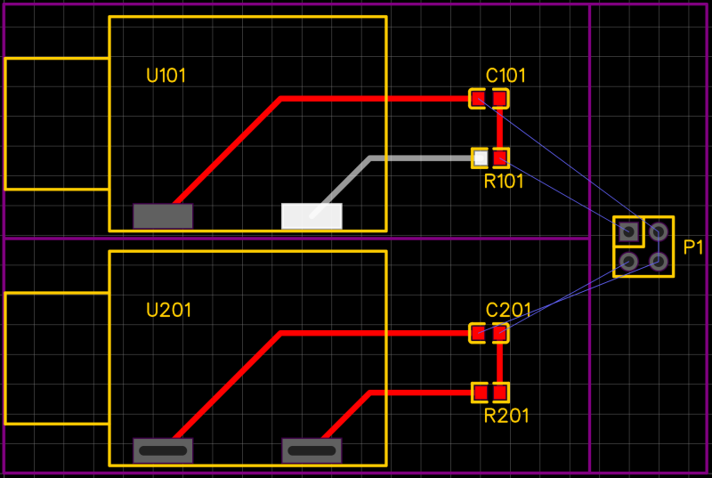

# easyeda_multichannel
Python script allowing multi-channel design in EasyEDA.
Script is already capable of generating multi-channel PCB matched with the schematic.
Tested with EasyEDA up to 6.4.25.

## Installation
Python 3.6 (or compatible version) is required. No additional modules are used.

## How to use
1. Split your design into 2 separate projects:
- One with a single channel (schematic and PCB). Schematic shall contain only 1 sheet.
- One with the rest of your design.

2. Download both projects, unzip them and put to the same directory as the script.
Copy **config.py.template** as your local **config.py** and edit it. Set desired file names,
channel names, PCB offset X and Y, then run the script.

Script will update all of the channel nets according to the configured **channel_net_style** (e.g. by adding an underscore and a channel name).
For example, a net named **INPUT** will become **INPUT_CH1**, **INPUT_CH2** in the output design. Power/ground ports remain
unmodified. Also channel nets which names start with **G:** are treated as global, while the **G:** prefix itself it being removed in the output *(special thanks to @timveldhuizen for this feature)*.

The component prefixes can be configured to increment by a specified number (e.g. **U1** becomes **U101**, **U102**) or processed in the same way as the nets (**U1_CH1**, **U1_CH2**).
Behavior depends on the **channel_prefix_incr** setting in the config file (either True or False).

3. Open the generated output schematic and PCB with EasyEDA. Preferrably save as a new project.
Try to update PCB from schematic in order to check whether they match.

## Maintaining your design
Make changes to your original projects (channel and main), then use the script to generate final version.

## Example
Consider following schematic of the channel and a respective PCB:

 

The following schematic will be used as a main source. Note the suffixes **_CH1**, **_CH2** that will be added by the script to the output of each channel.

 

Running the script with the default provided config.py.template will give the following output. The resulting schematic has 3 sheets (Main + 2x channel). Power ports remain global, thus **GND** is connected together.

 

## Known Issues
- Some dummy warnings are produced (to be improved in future)
